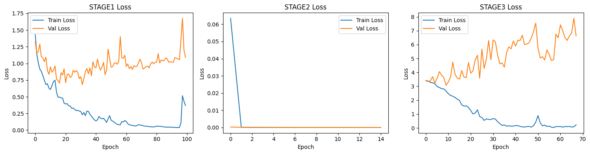
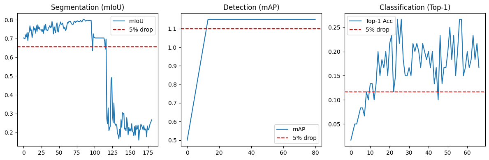

# Unified Multi-Task Model Report

## Model Architecture

1. **Input**  
    - Shape input: [B, 3, 512, 512]

2. **Backbone**  
    - `self.low_feat = nn.Sequential(*features[:4])`  
        - MobileNetV3 前四層，downsample 512/8=64。主要提取低階特徵。  
        - Shape input: [B, 3, 512, 512]  
        - Shape output: [B, 24, 64, 64]
    - `self.high_feat = nn.Sequential(*features[4:])`  
        - MobileNetV3 後續所有層，downsample 512/32=16。抓深層語意特徵。  
        - Shape input: [B, 24, 64, 64]  
        - Shape output: [B, 576, 16, 16]

3. **Neck**  
    - `low = F.adaptive_avg_pool2d(low, 16)`  
        - 低階特徵縮小到 16x16  
        - Shape input: [B, 24, 64, 64]  
        - Shape output: [B, 24, 16, 16]
    - `self.reduce_low(low)`  
        - 低階通道數由 24 → 64，準備和高階拼接。  
        - Shape input: [B, 24, 16, 16]  
        - Shape output: [B, 64, 16, 16]
    - `self.reduce_high(high)`  
        - 高階通道數 576 → 64。  
        - Shape input: [B, 576, 16, 16]  
        - Shape output: [B, 64, 16, 16]
    - `torch.cat([low, high], dim=1)`  
        - 通道合併。  
        - Shape output: [B, 128, 16, 16]
    - `self.fuse`  
        - Conv2d(128, 128, 3, padding=1) → BN → ReLU  
        - Conv2d(128, 256, 3, padding=1) → BN → ReLU  
        - Shape input: [B, 128, 16, 16]  
        - Shape output: [B, 256, 16, 16]

4. **Unified Head**  
    - `self.head`  
        - Conv2d(256, 256, 3, padding=1) → ReLU  
        - Conv2d(256, 256, 3, padding=1) → ReLU  
        - Shape input: [B, 256, 16, 16]  
        - Shape output: [B, 256, 16, 16]
    - `self.det_seg_cls_head`  
        - Conv2d(256, (5+det)+(seg)+(cls), 1) = (256, 76, 1)  
        - Shape input: [B, 256, 16, 16]  
        - Shape output: [B, 76, 16, 16]

5. **Three Heads**
    - **Detection head**
        - Shape input: [B, 76, 16, 16]
        - Shape output: [B, 25, 16, 16]
    - **Segmentation head**
        - seg_out = F.interpolate(seg_out, size=(512, 512))
        - Shape input: [B, 21, 16, 16]
        - Shape output: [B, 21, 512, 512]
    - **Classification head**
        - cls_out = F.adaptive_avg_pool2d(cls_map, 1).squeeze(-1).squeeze(-1)
        - Shape input: [B, 30, 16, 16]
        - Shape output: [B, 30]

## Model Summary

- Backbone: MobileNetV3-Small
- Total Parameters: 2.61M
- Input Size: 512x512

## Inference Speed

- Average inference time per 512x512 image: 15.89 ms
- Meets 150 ms specification.

## Evaluation Metrics

| Stage    | mIoU  | mAP   | Top-1 |
|----------|-------|-------|-------|
| Stage 1  | 0.706 |   –   |   –   |
| Stage 2  | 0.703 | 1.150 |   –   |
| Stage 3  | 0.263 | 1.150 | 0.12  |

## Training Curves

## Discussion

- 模型大小、推理速度均符合規格。
- Segmentation mIoU 在 Stage 1 單獨訓練時達到 0.706，進入Stage 2後僅有輕微下降0.703，顯示前兩任務間共用 backbone 的干擾有限。
在 Stage 3，segmentation mIoU 降至 0.263，顯示分類任務極大地干擾了模型對語意分割任務的表徵能力，發生嚴重的災難性遺忘。
- Detection mAP 在 Stage 2 後提升至 1.150，並在 Stage 3 保持不變，代表 classification 任務對 detection 頻道影響相對有限，可能因為 detection 分支的特徵需求與 backbone 的共享特徵較為契合。
- Classification Top-1 Accuracy 僅有 0.12，遠低於 MobileNetV3-Small 單任務時的標準表現。主因推測為 backbone 已優先學習對 segmentation/detection 有利的空間與區域特徵，而無法學到分類所需的 global 表徵。
- 本次模型在三任務同時進行時，出現明顯的任務間干擾，特別是 classification 對 segmentation 的負面影響最顯著，可能需要更先進的 multi-task architecture或更細緻的知識蒸餾以緩解災難性遺忘與提升各任務的穩定性。
